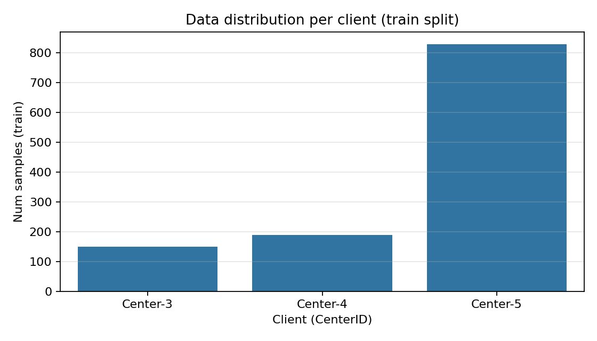
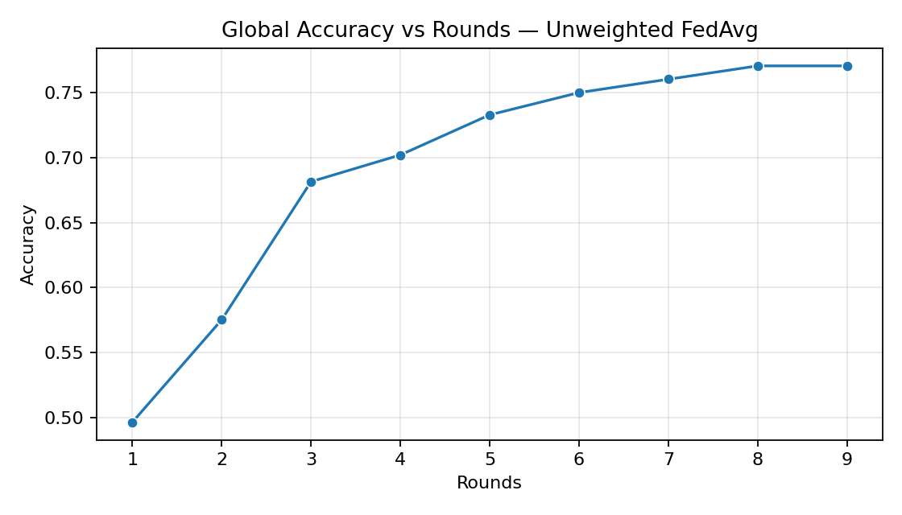
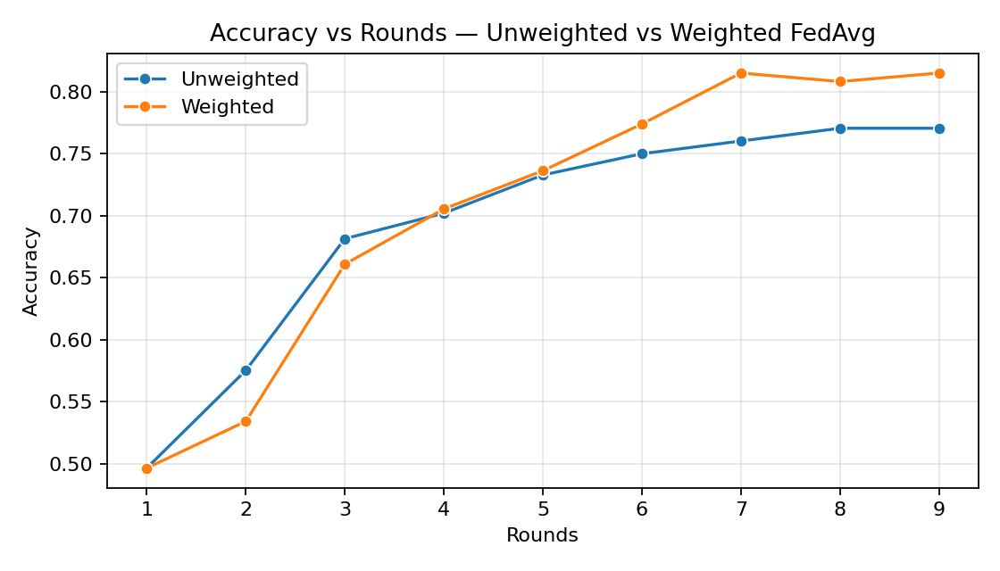
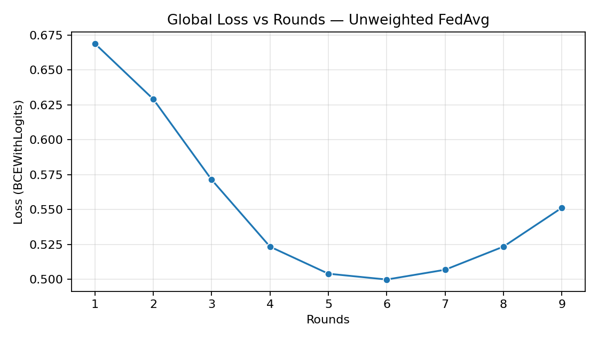
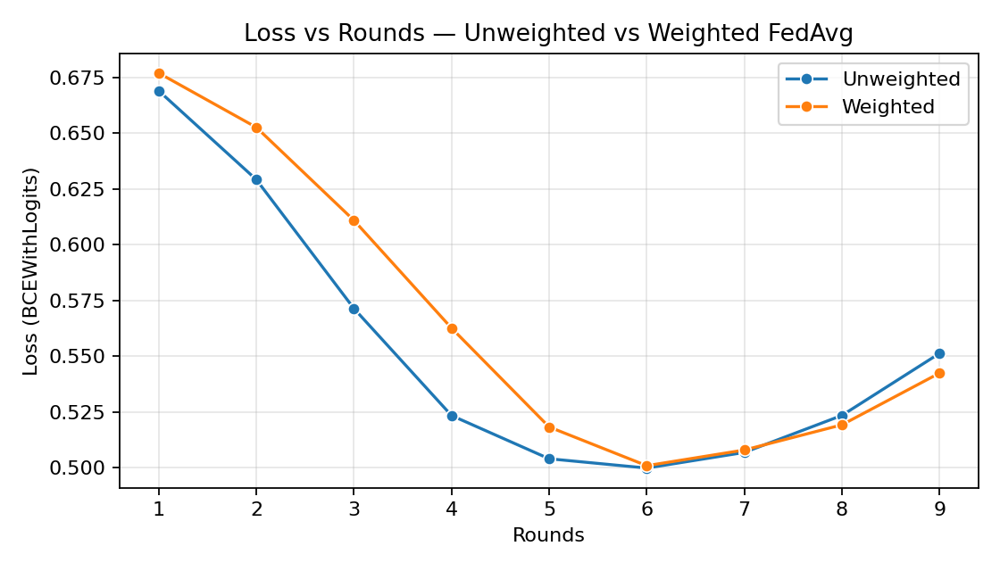

# 🧠 Federated Learning – eHealth Project

## 1. Objective
This section presents the results of **Federated Learning (FL)** experiments conducted on the eHealth dataset.  
Two FL aggregation strategies were compared:

- **FedAvg (Unweighted)**: All centers contribute equally to the global model.
- **FedAvg (Weighted)**: Each center contributes proportionally to its dataset size.

The goal is to evaluate how weighting impacts the model’s convergence and accuracy.

---

## 2. Client Data Distribution

### Interpretation:
- Each bar represents the number of patient samples per center (`CenterID`).
- **Center-5** dominates the dataset (~800+ samples), while **Center-3** and **Center-4** are smaller contributors.
- This imbalance is crucial in FL: larger centers have a stronger influence in **Weighted FedAvg**.

---

## 3. Accuracy Over Rounds

### a. Unweighted FedAvg

### b. Weighted vs Unweighted Comparison

### Interpretation:
- The **unweighted** version shows a steady improvement up to around **round 7–8**.
- The **weighted** version converges **faster** and reaches slightly **higher accuracy** (≈0.80).
- Weighting helps the model leverage the richer information from the larger client (**Center-5**).

---

## 4. Loss Evolution

### a. Unweighted FedAvg

### b. Weighted vs Unweighted Comparison

### Interpretation:
- Both models show a consistent **decrease in loss** until early stopping.
- Weighted FedAvg’s loss decreases more sharply in the first few rounds (faster convergence).
- The early stopping mechanism prevents overfitting once validation loss stops improving.

---

## 5. Global Evaluation Metrics

| Model Type          | Best Accuracy | Final Loss | Early Stop | Convergence Round |
|---------------------|---------------|-------------|-------------|-------------------|
| **FedAvg (Unweighted)** | ~0.77 | 0.50 | ✅ Yes | ~Round 9 |
| **FedAvg (Weighted)**   | **~0.80** | **0.51** | ✅ Yes | ~Round 6 |

### Interpretation:
- Both approaches perform well, with the weighted version being slightly superior.
- Weighted FedAvg gives more importance to data-rich clients, which can improve global generalization but reduce fairness.
- The **unweighted** version is more balanced and democratic but converges slower.

---

## 6. Conclusion
- **Weighted FedAvg** reaches better accuracy faster due to the influence of large centers.  
- **Unweighted FedAvg** offers more stable learning when clients have similar importance.  
- The early stopping criterion prevented unnecessary rounds and overfitting.
- This confirms the expected trade-off between **performance and fairness** in Federated Learning.

---

## 7. Exported Files

After running `fl_plots.py`, the following files are generated under `../Ressources/plots/`:

| File | Description |
|------|--------------|
| `acc_unweighted.png` | Accuracy curve (unweighted FL) |
| `loss_unweighted.png` | Loss curve (unweighted FL) |
| `acc_weighted_vs_unweighted.png` | Accuracy comparison |
| `loss_weighted_vs_unweighted.png` | Loss comparison |
| `client_distribution.png` | Data distribution per client |
| `history_unweighted.csv` | Raw numeric history of unweighted FL |
| `history_weighted.csv` | Raw numeric history of weighted FL |

---